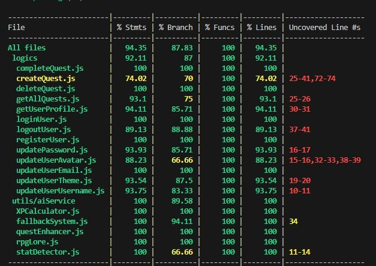

# NEST APP

## Description

NEST App is a full-stack gamified agenda application that transforms daily tasks into epic quests. Users create missions, complete them to gain XP and level up, unlocking new features and developing their character stats through a comprehensive RPG-inspired progression system.

## Functional Description

### Core features
- User authentication
- Quest management
- AI-Powered generation
- Gamification system
- Theme system
- Avatar customization
- Responsive design

### Use cases
- Personal productivity
- Skill development
- Habit formation
- Goal achievement
- Motivation enhancement

## UX/UI Design

[My Figma](https://www.figma.com/design/L6Msy1Yl53H9ZR50ACgQU1/Nest-App?node-id=1-4&t=5zI5ZUyGC4XngijW-1)
### Design Principles
- **Minimalist aesthetic** - Clean, distraction-free interface
- **Gamification elements** - Progress bars, level indicators, stat visualization
- **Responsive layout** - Mobile-first design with desktop optimization
- **Theme consistency** - Unified color palette and typography system

## Technical Description


### Technologies and libraries

#### Frontend Stack
- **React 18**
- **Vite**
- **Tailwind CSS**
- **React Router 6**
- **Context API**

#### Backend Stack
- **Node.js**
- **Express 4**
- **MongoDB**
- **Mongoose**

#### Security & Authentication
- **bcrypt**
- **JWT (jsonwebtoken)**
- **Token Blacklist**

#### Testing & Quality
- **Mocha & Chai**
- **C8**
- **Custom CURL Scripts**

#### External APIs
- **Groq AI API**
- **Stat Detection Algorithm**


## Data Models

### Routes

#### Authentication endpoints
- POST   /api/users/register     - User registration \
- POST   /api/users/login        - User authentication \
- POST   /api/users/logout       - Secure logout with token blacklist \
- GET    /api/users/profile/:id  - Get user profile data

#### Quest management
- GET    /api/quests             - Get user's quests \
- POST   /api/quests/create      - Create new quest (manual/AI) \
- PUT    /api/quests/:id/complete - Mark quest as completed \
- DELETE /api/quests/:id         - Delete quest \
- PUT    /api/quests/:id         - Update quest details 

#### User updates
- PUT    /api/users/username     - Update username \
- PUT    /api/users/email        - Update email address \
- PUT    /api/users/password     - Change password \
- PUT    /api/users/theme        - Update visual theme \
- PUT    /api/users/avatar       - Update avatar configuration 

### 👤 User Schema
```javascript
{
  _id: ObjectId,
  username: String (3-20 chars, unique),
  email: String (valid format, unique),
  password: String (hashed with bcrypt),
  totalXP: Number (default: 0),
  currentLevel: Number (default: 1),
  stats: {
    STRENGTH: Number (default: 0),
    DEXTERITY: Number (default: 0),
    WISDOM: Number (default: 0),
    CHARISMA: Number (default: 0)
  },
  preferences: {
    theme: String (default: 'default'),
    notifications: Boolean (default: true)
  },
  avatar: {
    equippedSet: String (default: 'default')
  },
  createdAt: Date,
  updatedAt: Date
}
```
#### Quests
```js
{
  _id: ObjectId,
  userId: ObjectId (ref: 'User'),
  title: String (3-200 chars),
  description: String,
  difficulty: Enum ['QUICK', 'STANDARD', 'LONG', 'EPIC'],
  experienceReward: Number (calculated by difficulty),
  targetStat: Enum ['STRENGTH', 'DEXTERITY', 'WISDOM', 'CHARISMA'] | null,
  isCompleted: Boolean (default: false),
  completedAt: Date | null,
  isDaily: Boolean (default: false),
  generatedBy: Enum ['user', 'ai', 'epic_fallback'],
  tags: [String],
  epicElements: Object | null,
  aiMetadata: Object | null,
  createdAt: Date,
  updatedAt: Date
}
```
### Test Coverage



### Project

[Nest App](http://nest-app.surge.sh)
